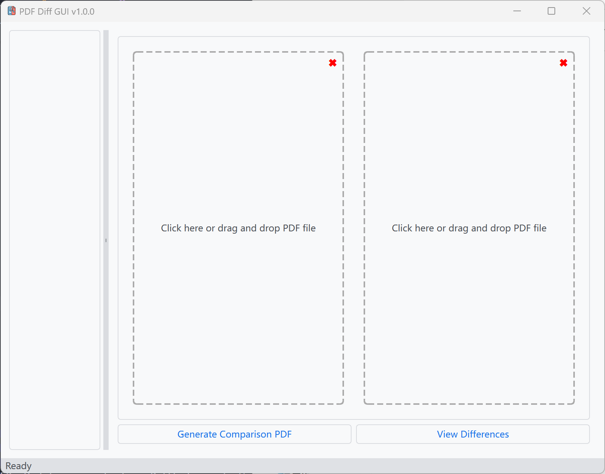

# Diff PDF Gui

This tool is a GUI for [diff-pdf](https://github.com/vslavik/diff-pdf). It allows you to compare two PDF files and view the differences.




## Features

- Drag and drop interface for selecting PDF files
- Generate comparison PDFs highlighting differences between two files
- View differences in a separate viewer

## Requirements

- Python 3.11 (tested)
- PySide6
- pyqtdarktheme
- [diff-pdf](https://github.com/vslavik/diff-pdf/releases)

## Installation

1. Clone this repository:
   ```
   git clone git@github.com:665465/diff-pdf-gui.git
   cd diff-pdf-gui
   ```

2. Install the required Python packages:
   ```
   pip install -r requirements.txt
   ```

3. Download diff-pdf from [here](https://github.com/vslavik/diff-pdf/releases) and extract it to the `diff-pdf-win` folder. For example:
   ```
   diff-pdf-gui/
   ├── diff-pdf-win/
   │   └── diff-pdf.exe
   ├── pdf-diff-gui.py
   └── requirements.txt
   ```
   if you are using Linux or MacOS, you can install diff-pdf from your package manager.

4. Run the application:
   ```
   python pdf-diff-gui.py
   ```